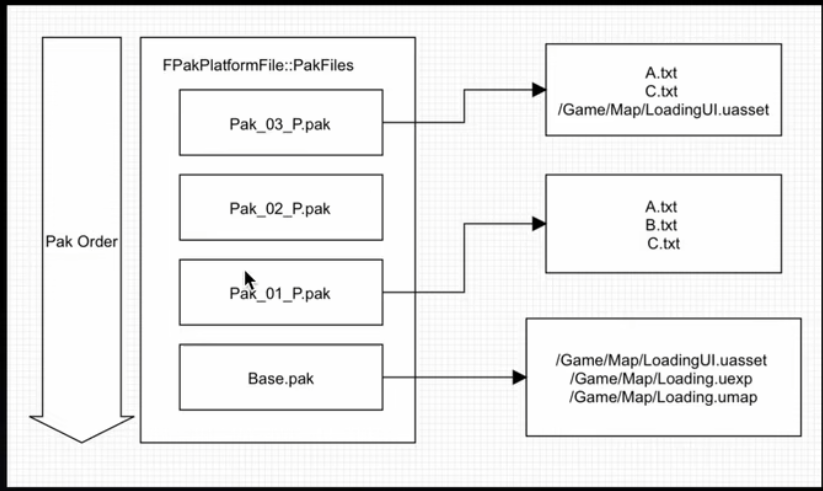
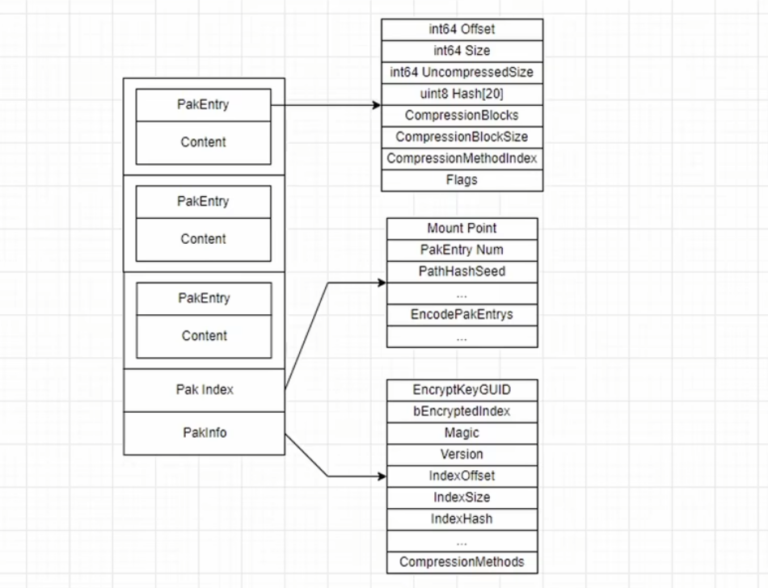
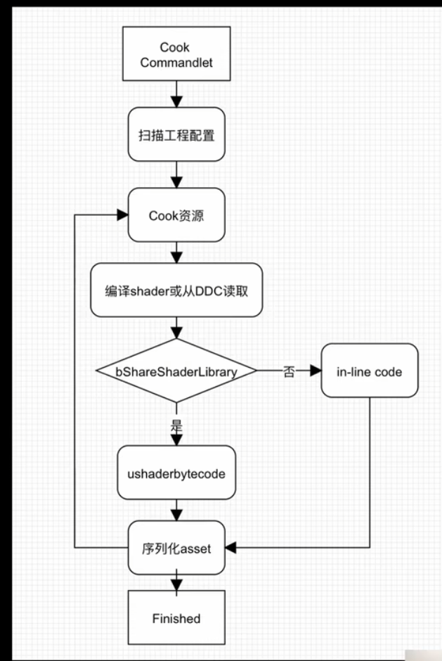

# 1. *.pak file 

    用于较少访问的松散文件。挂载Pak文件之后，也会挂载对应的容器文件.
    
    主要放置非资产文件
# 2. *.utoc

    描述了容器文件，包括数据块大小和偏移、压缩格式以及是否加密数据块 

    目录文件 = pak的文件索引区 + package的summary
# 3. *.ucas

    包含实际数据. uasset, umap, ubulk, uexp

# 4. 基础包内容
 - Cooked uasset
    由通用格式经过烘培后，成为指定的平台格式
 - Slate 资源
 - Internationalization
    文本翻译
 - .uproject/ .uplugin
  .uproject用于知道项目有什么插件，包含什么模块
  .uplugin用于知道插件的启动时机
 - Config
  ini文件，用于指导引擎启动配置
 - AssetRegistry.bin
  工程资源索引表，记录项目资源信息
 - ushaderbytecode
  项目shader code序列化为一个文件
 - shadercache
 - 添加的Non-Asset

# 5. Unreal File System (UFS)
烘培后资源存于pak

根据优先级读取pak 

控制pak挂载时机

默认读取order最大的pak的文件

# 6.pak 作用和archive格式 
pak mount文件查询优化

基础加密

压缩

pakCache预加载

# 7. pak创建
收集要打包的资源和外部文件
- cook uasset
- 存储打包的Response文件（PakList*.txt）
- 用UnrealPak打包

ResponseFile格式：文件绝对路径 Mount后的路径 + 打包参数

# 8. Metadata更新
- Shader
- AssetRegistry
- ini

# 9. Shader更新

